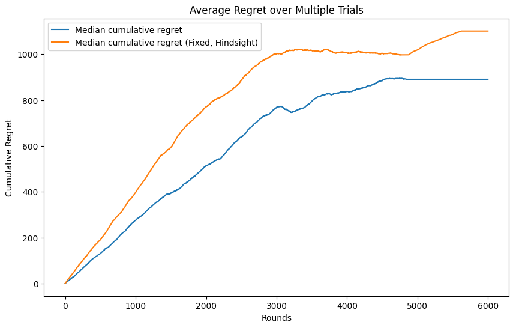

# Online Learning Applications: Dynamic Pricing
## Status of the Work
| Requirement | Stato di completamento | Note |
| :--- | :--- | :--- |
| 1. Requirement 1: Single product and stochastic environment |  | Sublinear regret |
| 2. Requirement 2: Multiple products and stochastic environment |  | Sublinear regret  |
| 3. Requirement 3: Best-of-both-worlds algorithms with a single product |  | Sublinear regret |
| 4. Requirement 4: Best-of-both-worlds with multiple products |  | Sublinear regret |
| 5. Requirement 5: Slightly non-stationary environments with multiple products |  | Sublinear regret and relevant comparison |
| Presentation |  |

## Authors
This Project was developed by:
- Carminati Gabriele
- Compagnoni Riccardo Domingo
- De Introna Federico
- Di Giore Francesco
- Fossa' Chiara

## Introduction
This is the repository for the Project of Online Learning Applications in the academic year 2024/2025.
The project includes 5 requirements to analyze various algorithms in different scenarios:
1. Single product and stochastic environment
2. Multiple products and stochastic environment
3. Best-of-both-worlds algorithms with a single product
4. Best-of-both-worlds with multiple products
5. Slightly non-stationary environments with multiple products

## Features
- **Sublinear regret**: all the algorithms achieve sublinear regret in different environments and after multiple trials, being robust and consistent.
- **Self-contained notebooks**: it is sufficient to export the notebooks in a working python/jupyter environment and run them.
- **Meaningful analyses**: each algorithm has been analyzed and tested taking into account several different cases, with different parameters and behaviors.  

## General setting of the project
The goal of the project is to design online learning algorithms to sell multiple types of products under production constraints.
#### Parameters
- Number of rounds T
- Number of types of products N
- Set of possible prices P (small and discrete set)
- Production capacity B (For simplicity, there is a total number of products B that the company can produce (independently from the specific type of product)
#### Buyer's behavior
- Has a valuation vi for each type of product in N
- Buys all products priced below their respective valuations
#### Interaction
At each round $$t \in T$$:
1. The company chooses which types of product to sell and set price $$p_{i}$$ for each type of product.
2. A buyer with a valuation for each type of product arrives.
3. The buyer buys a unit of each product with price smaller than the product valuation.

## Requirement 1: Single product and stochastic environment
 Build a **stochastic** environment: a distribution over the valuations of a single type of product. Then, build a pricing strategy using UCB1 **ignoring the inventory constraint** and build a pricing strategy extending UCB1 to handle the **inventory constraint**.
 First, we used UCB1 to fulfill the first part of the requirement, achieving **sublinear** regret. Then, we extended the UCB1 to deal with the inventory constraint, achieving also in this case **sublinear** regret.
 <table>
  <tr>
    <td valign="top" align="center">
        <h4>UCB1</h4>
      
       
    </td>
    <td valign="top" align="center">
        <h4>UCB1_with_budget</h4>
      
       
    </td>
  </tr>
</table>

## Requirement 2: Multiple products and stochastic environment
Build a **stochastic** environment: a joint distribution over the valuations of all the types of products. Build a pricing strategy using Combinatorial-UCB **with the inventory constraint**.
So, the environment includes a **logit-normal** distribution to deal with multiple products and joint valuations. The **Combinatorial UCB** has been extended with **Gaussian Processes (GP)** for the selection of prices.
The regret is **sublinear**.
<table>
  <tr>
    <td valign="top" align="center">
        <h4>CombUCB-GP</h4>
      
       
    </td>
  </tr>
</table>

## Requirement 3: Best-of-both-worlds algorithms with a single product
Build a **highly non-stationary stochastic** environment: a sequence of valuations of the product (e.g., sampled from a distribution that changes **quickly** over time). Build a pricing strategy using a primal-dual method **with the inventory constraint**.
So, the environment includes different distributions whose non-stationarity is achieved thorugh means **jumps, spikes, drifts**. The **Primal-Dual** algorithm is based on the **EXP3.P** algorithm, that is suitable for dynamic pricing in non-stationary environment. The achieved regret is **sublinear**.
For further information, visit https://cesa-bianchi.di.unimi.it/Pubblicazioni/J18.pdf.
<table>
  <tr>
    <td valign="top" align="center">
        <h4>Primal-Dual</h4>
      
       
    </td>
  </tr>
</table>

## Requirement 4: Best-of-both-worlds with multiple products
 Build a **highly non-stationary stochastic** environment: a sequence of correlated valuations for each type of product (e.g., sampled from a distribution that changes **quickly** over time).  Build a pricing strategy using a primal-dual method **with the inventory constraint**. So, the environment includes a **logit-normal** distribution to deal with multiple products and joint valuations and **drifting means** to represent non-stationarity. The **Primal-Dual** algorithm is based on the **EXP3.P** algorithm, that is suitable for dynamic pricing in non-stationary environment, having a EXP3.P agent for each product. The achieved regret is **sublinear**.
 <table>
  <tr>
    <td valign="top" align="center">
        <h4>Primal-Dual</h4>
      
       
    </td>
  </tr>
</table>

## Requirement 5: Slightly non-stationary environments with multiple products
 Build a **slightly non-stationary stochastic** environment for the pricing problem:
 - Rounds are partitioned in intervals
 - In each interval the distribution of products valuations is fixed
 - Each interval has a different distribution

Extend Combinatorial-UCB with sliding window and compare its performance with the performance of Primal-Dual method. Given the extended algorithm with SW of requirement 2 and Primal-Dual algorithm of requirement 4, they were compared against each other on the new environment. The achieved regret is **sublinear**.
<table>
  <tr>
    <td valign="top" align="center">
        <h4>CombUCB-GP-SW</h4>
      
       
    </td>
    <td valign="top" align="center">
        <h4>Primal_Dual vs CombUCB-GP-SW</h4>
      
       
    </td>
  </tr>
</table>

